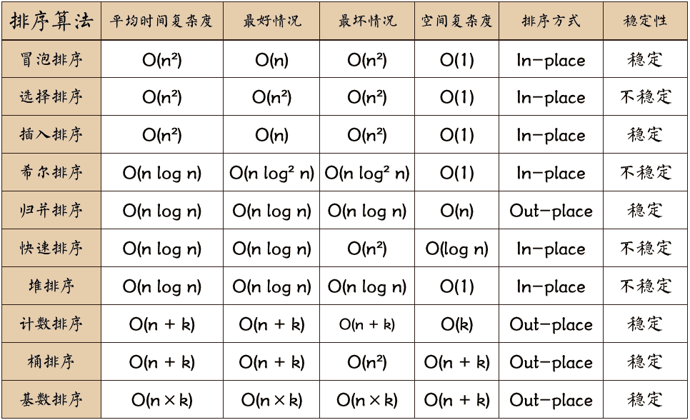

# 从零开始的刷题
## 参考
[[力扣刷题攻略] Re：从零开始的力扣刷题生活](https://leetcode.cn/circle/discuss/E3yavq/)

## 章节
### 数组篇
- 对应文件夹： `array`
#### 知识点
- [C++ vector的使用总结及常用vector操作](https://blog.csdn.net/p942005405/article/details/100588611)
- [C++ unordered_map详解](https://blog.csdn.net/zou_albert/article/details/106983268)
- [c++ unordered_map4种遍历方式](https://blog.csdn.net/qq_21539375/article/details/122003559)
#### 做题列表
1. 数组的改变和移动

| 序号 | 题目 | 备注
|----|----|----
| 453| 最小操作次数使数组元素相等| 主要学会该题的“思路转换”
|665|非递减数列|自己最初的做法有点面向测试编程了，应该总结抽象出规则才对
|283|移动零| 双指针法或直接操作下标

2. 旋转数组

| 序号 | 题目 | 备注
|----|----|----
| 189| 轮转数组 | 
|396| 旋转函数| 找规律……暴力法会超时

3. 统计数组中的元素

| 序号 | 题目 | 备注
|----|----|----
| 645 | 错误的集合 | 第一下没做出来
| 697 | 数组的度 | 第一下没做出来。题解使用了hash表，对应的数据结构为unordered_map
| 448 | 找到所有数组中消失的数字 | 三种方法，暴力求解会超时，可以用哈希表来空间换时间，但直接把nums当成hash表进行原地修改，效果更好！
| 442 | 数组中重复的元素 | 和448的方法-即原地修改一样（感觉后面448、442这种题都可以这么来）
| 41 | 缺失的第一个正数 | (困难题) 也是原地hash的思路，但难的是如何设置hash value（前面的题是直接加n，但这道题不是）

4. 数组的遍历

| 序号 | 题目 | 备注
|----|----|----
| 485 | 最大连续1的个数 | (简单题)没什么好讲的
| 495 | 提莫攻击 | （简单题）遍历即可
| 414 | 第三大的数 | （简单题）要求时间复杂度在O(n)，实际上有两种方法，一个是一次遍历，还有一个是利用数据结构（有序集合）set
| 628 | 三个数的最大乘积 | （简单题）可以先排序再找（nlogn）或者直接用线性扫描（n），注意该题要考虑两种情况，不能漏了【两个最小负数 ✖️ 一个最大正数】的可能

5. 二维数组及滚动数组

| 序号 | 题目 | 备注
|----|----|----
| 118 | 杨辉三角 | (简单题)没什么好讲的
| 119 | 杨辉三角 | (简单题)和上一题相比的话主要是看怎么优化——1. 滚动数组；2. 在原数组上进行**逆向** 的操作
| 661 | 图片平滑器 | （简单题）就是二维数组的遍历，注意下细节就好
| 598 | 范围求和II | (简单题) 找最短长和最短宽，根据题来抽象
| 419 | 甲板上的战舰 | 自己做的时候进阶版本的思路是有的，最后也做了出来，但还是太复杂了，可以参考题解（枚举：通过枚举每个战舰的左上顶点（即当前顶点为“X”并且上方和左方为“.“即认为是一艘新的战舰）即可统计战舰的个数。

6. 特定顺序遍历二维数组

| 序号 | 题目 | 备注
|-|-|-
| 54 | 螺旋矩阵 | 每一圈顺时针遍历一圈都是一样的，只不过上下左右边界不同而已，关键是控制好上下左右边界
| 59 | 螺旋矩阵II | 和54思路一样，只不过要注意下二维数组初始化的方式：`vector<vector<int>> res(n, vector<int>(n, 0));`
| 498 | 对角线遍历 | 模拟法，鬼知道我当时做了多久……

7. 二维数组变换

| 序号 | 题目 | 备注
|-|-|-
| 566 | 重塑矩阵 | （简单题）没什么好说的，涉及到/与%操作
| 48 | 旋转图像 | 找规律啊找规律
| 289| 生命游戏 | 要求原地修改，可以设置多个状态，然后第二次遍历的时候再去修改

8. 前缀和数组

| 序号 | 题目 | 备注
|-|-|-
| 303| 区域和检索-数组不可变 | (简单题)
| 304 | 二维区域和检索 - 矩阵不可变| 和上题类似
| 238 | 除自身以外数组的乘积 | 用两个额外的数组存储从左边计算的前缀积和右边计算的前缀积

### 链表篇
- 对应文件夹：`linked_list`

#### 知识点
- 链表的题通常需要注意两点：
1. 舍得用变量，千万别想着节省变量，否则容易被逻辑绕晕
2. head 有可能需要改动时，先增加一个假head（即哨兵节点sentinel），返回的时候直接取 假head.next，这样就不需要为修改 head 增加一大堆逻辑了。

- [C++ STL栈（stack）结构及使用](https://blog.csdn.net/Flag_ing/article/details/123554966)
- 在【链表的旋转和反转】时，一定！一定！一定要在草稿纸上画一下，否则很容易在指针变换时成环从而报错！
- [Leetcode博客：一文搞定链表常见问题](https://leetcode.cn/problems/linked-list-cycle/solutions/175734/yi-wen-gao-ding-chang-jian-de-lian-biao-wen-ti-h-2/)

#### 做题列表

1. 移除与插入链表元素

| 序号 | 题目 | 备注
|-|-|-
| 707 | 设计链表 | 主要学习如何写链表的基本结构
| 203 | 移除链表元素 | 多创建一个哨兵节点（sentinel）指向head，后续直接遍历即可
| 19 | 删除链表的倒数第N个结点 | 使用栈或双指针法可以达成一次遍历的目的
| 83 | 删除排序链表中重复的元素 | （ 简单题）
| 82 | 删除排序链表中的重复元素 II | 双指针法

2. 链表的遍历

| 序号 | 题目 | 备注
|-|-|-
| 430 | 扁平化多级双向链表 | 深度优先搜索
| 114 | 二叉树展开为链表 | 前序遍历

3. 链表的旋转与反转

| 序号 | 题目 | 备注
|-|-|-
| 61 | 旋转链表 | 两次遍历,第一次遍历到尾节点，第二次遍历到新的头节点
| 24 | 两两交换链表中的节点 | 1. 模拟法，三指针进行交换；2. 递归
| 206 | 反转链表 | 谨记：无论用栈还是用递归，在修改时都要小心链表成环！！；其次在使用`递归`时，一个方便思考的方法是先想清楚这个递归函数是干什么的，其返回值是什么，通过假设其余部分已经完成了工作，辅助思考前面的部分要如何完成，从而界定边界条件（对于本题来说，其关键在于反向工作。假设链表的其余部分已经被反转，现在应该如何反转它前面的部分——即假设从节点nk+1到nm（nm为tail节点）已经被反转，而我们正处于nk）
| 92 | 反转链表 II | 这道题耗了很多时间，主要是在画图的时候没有仔细可能存在的“成环问题”
​| 25 | K个一组翻转链表 | （困难题）模拟法，感觉和前面的题目差不多，当不起“困难”的难度

4. 链表高精度加法

| 序号 | 题目 | 备注
|-|-|-
|2| 两数相加 | 1. 模拟法（情况要覆盖全，关键是不要漏），最终要的是，不要忘记最后判断carry是否还是1的情况！！
|445| 两数相加 II | 其实是在“两数相加”的基础上将排列顺序调换了一下，而且其实不用一定要在最长的链表上进行修改操作，直接遇到空节点进行补新节点就好了
|0205 |面试题 02.05. 链表求和 | 和第二题基本一样。要考虑*正向*或*反向*存储，同时要考虑最后carry是否为1

5. 链表的合并

| 序号 | 题目 | 备注
|-|-|-
|21| 合并两个有序链表 | (简单题)没什么好说的，可以参考下递归是怎么做的
|***23***| 合并K个有序列表 | （分治法）感觉是归并排序，但是就是没做出来

6. 链表中的双指针技巧

| 序号 | 题目 | 备注
|-|-|-
| 86 | 分隔链表 | 自己做的时候时间上用了三指针，一个指向当前小于x的子链表的末尾，一个指向当前要判断的节点，一个指向了当前要判断的节点的前驱节点
| 19 | 删除链表的倒数第N个结点 | 使用栈或双指针法可以达成一次遍历的目的
| 141| 环形链表 | （简单题）典中典了属于是。快慢双指针，类似于径赛中400环形跑道的“套圈”
| 142| 环形链表II | 推数学公式，得到“相遇点到成环点的距离和起点到成环点的距离相等”的结论
| 876 | 链表的中间节点|（简单题）快慢双指针
| 143 | 重排链表 | 1. STL的deque双端队列好像Leetcode总是会报错；2. 链表反转+链表中点+链表合并(**这道题要好好看看**)
| 160 | 相交链表 | （简单题）用栈来反向匹配、哈希表数据结构也类似；双指针解法也有点意思可以看看。[本题题解](https://leetcode.cn/problems/intersection-of-two-linked-lists/solutions/811625/xiang-jiao-lian-biao-by-leetcode-solutio-a8jn/)

### 链表篇
#### 知识点

1. [C++ STL unordered_map容器用法详解](http://c.biancheng.net/view/7231.html)
2. [C++ STL unordered_set容器完全攻略](http://c.biancheng.net/view/7250.html)

#### 做题列表

1. 哈希表的查找、插入及删除

| 序号 | 题目 | 备注
|-|-|-
| 706 | 设计哈希映射 |  (简单题)了解hash表的存储原理
| 217 | 存在重复元素| (简单题)
| 349 | 两个数组的交集 | (简单题)方法1：哈希集合；方法2：排序+双指针
| 290 | 单词规律 | (简单题) 但是涉及到“双射”的知识
| 128 | 最长连续子序列 | 暴力法：先sort，然后遍历；若要求O(n)的时间复杂度：可以使用unordered_set解决，同时添加一个跳过条件从而避免n平方的遍历总开销（具体见代码）
| 532 | 数组中的 k-diff 数对 | unordered_set的应用，题目比较简单，但要注意对重复值的过滤
| 205 | 同构字符串 | （简单题）unordered_map的应用。虽然简单但是也卡了一会儿，“双射”的应用
| 138 | 复制带随机指针的链表 | 本题的难点其实是在随机指针这里，但其实用hashmap(原节点->新节点)就可以解决，时间复杂度可以控制在O(2n)；还有一个很重要的点就是**不要忘记边界条件！！！即初始链表为空的情况**，否则无法通过所有测试用例

2. 哈希表与索引

| 序号 | 题目 | 备注
|-|-|-
| 1 | 两数之和 |  (简单题)unordered_map简单应用，时间复杂度O(n)
| 599 | 两个列表的最小索引总和 | (简单题)unordered_map简单应用 [但是leetcode是机翻的，You need to help them find out their common interest with the least list index sum. ，却翻译成了 你需要帮助他们用最少的索引和找出他们共同喜爱的餐厅。 with的意思翻译错了。 正确翻译应该是：你需要帮助他们找到索引和最小的共同喜爱的餐厅，即首先必须是双方共同感兴趣的餐厅，其次这家餐厅在两个数组中出现位置的索引和最小。]
| 219 | 存在重复元素 II | (简单题)unordered_map简单应用，时间复杂度O(n) （还可以用滑动窗口来解题）

3. 哈希表与统计

| 序号 | 题目 | 备注
|-|-|-
| 594 | 最长和谐子序列 | (简单题) 方法1：哈希表-unordered_map的遍历使用；方法2：可以将数组按照从小到大进行排序，我们只需要依次找到相邻两个连续相同元素的子序列，检查该这两个子序列的元素的之差是否为 1
| 350 | 两个数组的交集 II | (简单题)两个unordered_map的应用，一个小技巧：将判断放到第二个循环里，而不用再开第三个循环
| 554 | 砖墙 | 直接模拟法会超时，因此引入hashmap存储在某一列存在缝隙的个数
| 609 | 在系统中查找重复文件 | 主要涉及到字符串的拆分!!(要学会用封装好的函数find、substr等)，其次这题的存储结构要有印象
| 454 | 四数相加 II | 

4. 哈希表与前缀和

*这一子类要好好回顾下，第一次做的时候掌握的不是很好*

| 序号 | 题目 | 备注
|-|-|-
| 560 | 和为K的子数组 | 一时卡住了，前缀和两种方式：枚举或哈希优化（感觉滑动窗口也能做，但是边界很不好找）
| 523 | 连续的子数组和 | 和560的解题思路有异曲同工之妙，但是更为进阶。有三种解法，这道题值得分析！
| 525 | 连续数组 | 560、523、525是同一类题，要仔细看下，常规的枚举方法也能做，但往往会出现超时的情况。主要是掌握如何用hash进行优化——因为直接把前缀和作为key经常是行不通的

### 栈与队列篇

#### 知识点

#### 做题列表

1. 栈的实现

| 序号 | 题目 | 备注
|-|-|-
| 232 | 用栈实现队列 | 一个入栈，一个出栈
| 225 | 用队列实现栈 | 一个队列维护的是真实的栈顺序，另一个队列当作辅助队列进行插入（push）
| 0301 | 面试题 03.01. 三合一 | (简单题) 感觉没啥好做的，就是用一个数组实现三个栈，感觉用串行排列就好了
| 1441 | 用栈操作构建数组 | 不像中等题，更像是简单题

2. 单调栈

- **定义**：单调栈（Monotone Stack）：一种特殊的栈。 在栈的「先进后出」规则基础上，要求「从栈顶到栈底的元素是单调递增（或者单调递减）」。 其中满足从栈顶到栈底的元素是单调递增的栈，叫做「单调递增栈」。

| 序号 | 题目 | 备注
|-|-|-
| 496 | 下一个更大元素 I | 单调栈+哈希表(好好体会思想——[官方题解](https://leetcode.cn/problems/next-greater-element-i/solutions/1065517/xia-yi-ge-geng-da-yuan-su-i-by-leetcode-bfcoj/))
| 84 | 柱状图中最大的矩形 | (困难题)独立完成，栈里面去维护一个长方形的高，保持这个单调递增，遇到递减，就出栈然后更新
| 739 | 每日温度 | 和 ***496. 下一个更大元素 I*** 很像，这两题可以一起做
| 901 | 股票价格跨度 | 经典单调栈，没什么额外的难点
| 42 | 接雨水 | （困难）结合单调栈来做。其实还可以使用动态规划来完成

3. 最小/大栈

| 序号 | 题目 | 备注
|-|-|-
| 面试题 03.02 | 栈的最小值 | （简单题）构造一个存放当前最小值的辅助栈
| 剑指 Offer 30 | 包含min函数的栈 | （简单题）和0302代码一模一样，不做
| 155 | 最小栈 | 和和0302代码一模一样，不做

4. 字符串去重问题（后面专门再做一下这个）

- 字符串去重问题常见解法：

| 序号 | 题目 | 备注
|-|-|-
| 316 | 去除重复字母 | 没思路，看的[题解](https://leetcode.cn/problems/remove-duplicate-letters/solutions/527359/qu-chu-zhong-fu-zi-mu-by-leetcode-soluti-vuso/)。贪心 + 单调栈
| 1209 | 删除字符串中的所有相邻重复项II | 
| 1081 | 不同字符的最小子序列 | 与编号316相同

5. 栈与括号匹配

| 序号 | 题目 | 备注
|-|-|-
| 20 | 有效的括号 | （简单题）就是构造一个栈存储左边的括号，遇到右边括号就判断栈顶是否存在匹配的左值
| 636 | 函数的独占时间 | 和20题有异曲同工之妙，创建一个栈stk专门用来存放start状态的log，当栈中存在元素时，添加新元素则要更新值；当不存在元素时，添加新元素直接加就好；遇到end元素则将栈顶元素弹出并更新值，同时判断此时栈中是否还存在元素，如果存在元素则要将该元素的时间戳timestemp更新为当前end元素的时间戳+1
| 591 | 标签验证器 | 
| 32 | 最长有效括号 | （困难）看的[题解](https://leetcode.cn/problems/longest-valid-parentheses/solutions/314683/zui-chang-you-xiao-gua-hao-by-leetcode-solution/)……有点难

6. 表达式求值

| 序号 | 题目 | 备注
|-|-|-
| 150 | 逆波兰表达式求值 | 逆波兰表达式其实也就是后序遍历，后序遍历求值直接用栈来解决就好：遇到二元操作符（加减乘除）直接弹出两个元素，计算完之后再入栈就好
| 224 | 基本计算器 | （困难题）我的思路：中缀转为后缀的逆波兰表达式，然后再求——但是代码很长，面向用例编程无法全部测试用例跑通（42/44）；看代码[官方题解](https://leetcode.cn/problems/basic-calculator/solutions/646369/ji-ben-ji-suan-qi-by-leetcode-solution-jvir/)
| 227 | 基本计算器II | 思路上比224还简单点，因为没有括号。可以好好看看，里面有好几点需要特别注意的——**整型溢出问题、单调栈问题**
| 770 | 基本计算器IV | （困难题）讲真，看都懒得看，先放着先……

7. 用栈访问最后若干元素

| 序号 | 题目 | 备注
|-|-|-
| 682 | 棒球比赛 | （简单题）“看题说话”
| 71 | 简化路径 | 模拟法 + 栈存储文件名。题目是比较直观的。
| 388 | 文件的最长绝对路径 | 栈存储，其中元素为目录/文件的字符串长度。能保证遍历一遍输入字符串就能计算完。

8. 递归

| 序号 | 题目 | 备注
|-|-|-
| 385 | 迷你语法分析器 | 

9. 滑动窗口最大值问题

| 序号 | 题目 | 备注
|-|-|-
| 239 | 滑动窗口最大值 | （困难）这道题并不是特别难，主要是使用[优先队列](https://blog.csdn.net/weixin_36888577/article/details/79937886)

10. 求前 K 个高频元素

| 序号 | 题目 | 备注
|-|-|-
| 347 | 前 K 个高频元素 | 1. 粗暴排序法 2. 最大堆，开销为O(3N)< O(NlogN)
| 692 | 前 K 个高频单词 | 1. 哈希表 + 排序；2. 对于前k大、前k小这类问题，通用解法就是`优先队列`，优先队列可以在 O(log⁡n) 的时间内完成插入或删除元素的操作（其中 n 为优先队列的大小），并可以 O(1) 地查询优先队列顶端元素。

### 字符串篇

#### 知识点

1. [在 C++ 中将 char 转换为字符串的 10 种方法](https://www.techiedelight.com/zh/convert-char-to-string-cpp/)

#### 做题列表

1. 字符

| 序号 | 题目 | 备注
|-|-|-
| 520 | 检测大写字母 | （简单）ASCII码的应用

2. 回文串的定义

| 序号 | 题目 | 备注
|-|-|-
| 125 | 验证回文串 | （简单）主要是掌握回文串的判断

3. 公共前缀

| 序号 | 题目 | 备注
|-|-|-
| 14 | 最长公共前缀 | （简单）虽然是简单题，但有好几种解法，要好好看看!

4. 单词

| 序号 | 题目 | 备注
|-|-|-
| 434 | 字符串中的单词数 | （简单）没什么算法思想，直接做就好
| 58 | 最后一个单词的长度 | （简单） 倒序遍历就好了

5. 字符串的反转

| 序号 | 题目 | 备注
|-|-|-
| 344 | 反转字符串 | （简单）双指针法
| 541 | 反转字符串II | （简单）没那么简单……
| 557 | 反转字符串中的单词 III | （简单）可以用原地解法也可以用栈来辅助求解
| 151 | 反转字符串中的单词 | 两种解法：1. 前向检索的队列+栈；2. 后向检索的栈（性能最优）

6. 字符的统计

| 序号 | 题目 | 备注
|-|-|-
| 387 | 字符串中的第一个唯一字符 | （简单）hash。优化的话可以用到`数组`，性能会提升很多。
| 389 | 找不同 | （简单）hash
| 383 | 赎金信 | （简单）和`387`一样
| 242 | 有效的字母异位词 | （简单）解法和`387`一样
| 49  | 字母异位词分组 | 利用哈希，可以先将异位词转为词频数组，然后把词频数组转为字符串，这样字符串就可以变为hash的key直接比较查找
| 451 | 根据字符出现频率排序 | 哈希 + 最大堆
| 423 | 从英文中重建数字 | （中等）偏题怪题，有点像“脑筋急转弯”，主要是要分析题意，发现其中暗含的规律，比如某些字母只在某个数字中出现。
| 657 | 机器人能否返回原点 | （简单）过于简单，没有什么好说的
| 551 | 学生出勤记录 I | （简单）简单到过分
| 696 | 计数二进制子串 | （简单）先统计转换成数组，然后再进行计算（有算法那思路的）
| 467 | 环绕字符串中唯一的子字符串 | 有点难弄，需要用到动态规划的思想，本质上是求`连续递增子串的数目`

7. 数字与字符串间转换

| 序号 | 题目 | 备注
|-|-|-
| 299 | 猜数字游戏 | 虽然是[中等]，但是感觉不像中等级别，有点简单
| 412 | Fizz Buzz | （简单）太简单了……
| 506 | 相对名次 | （简单）直接上个排序
| 539 | 最小时间差 | （感觉比中等题简单）1. 先排序再计算
| 553 | 最优除法 | 1. 数学直接法；2. 动态规划（没太看懂）
| 537 | 复数乘法 | 分开计算，注意两点：1. 自定义函数如何返回数组（要以指针的方式返回）；2. 字符流进行字符串识别切割的操作；
| 592 | 分数加减运算 | 关键是`字符串的提取与识别`，本质上是模拟法（求两个数的最大公约数，可以用algorithm头文件中的gcd函数，也可以自己实现`欧几里得算法`）
| 640 | 求解方程 | 关键是`字符串的提取与识别`
| 38 | 外观数列 | 这道题`模拟法`就能解决
| 443| 压缩字符串 | 解题思路放到cpp注释里了，不是很难
| 8 | **字符串转换整数（atoi）**| 【重要】规则要捋清楚，思路比较简单但实现比较麻烦——字符串处理的题目往往涉及复杂的流程以及条件情况，如果直接上手写程序，一不小心就会写出极其臃肿的代码。因此采用`自动机`
| 13 | 罗马数字转整数 | （简单）其实就是条件分支语句的应用
| 12 | 整数转罗马数字 | 模拟法
| 273 | 整数转换英文表示 | （困难）没啥做的价值感觉……
| 165 | 比较版本号 | `stringstream`和`getline(str, temp_str, '.')`和`stoi字符串转整形函数`的应用
| 481 | 神奇字符串 | 

8. 子序列

| 序号 | 题目 | 备注
|-|-|-
| 392 | 判断子序列 | （简单）最直接的方法——遍历一遍即可
| 524 | 通过删除字母匹配到字典里最长单词 | 双指针
| 521 | 最长特殊序列 I | （简单）脑筋急转弯-没啥做的必要
| 522 | 最长特殊序列 II | 枚举

9. 高精度运算

| 序号 | 题目 | 备注
|-|-|-
| 66 | 加一 | （简单）数组操作，就是简单的进位操作
| 67 | 二进制求和 | （简单）这道题是二进制的计算，虽然简单，但实践起来没有那么容易，要多看一下！
| 415 | 字符串相加 | （简单）模拟法，和67题思路一模一样
| 43 | 字符串相乘 | 模拟法，只不过要很注意细节，涉及到的步骤比较多
| 306 | 累加数 | 官方题解是暴力法。。。（**没做**）

10. 字符串变换

| 序号 | 题目 | 备注
|-|-|-
| 482 | 密钥格式化 | 正常遍历
| 6 | Z字形变换 | 每行构造一个数组，模拟法即可
| 68 | 文本左右对齐 | （困难）搞了快1小时都做不出来md……直接看[题解](https://leetcode.cn/problems/text-justification/solutions/986756/wen-ben-zuo-you-dui-qi-by-leetcode-solut-dyeg/)吧（模拟法属实恶心心）

11. 字符串匹配

| 序号 | 题目 | 备注
|-|-|-
| 28 | 找出字符串中第一个匹配项的下标 | （简单）弱智题不做，遍历就好了，根本锻炼不到
| 686 | **重复叠加字符串匹配** | 该题可用1. 字符串哈希算法；2. Rabin-Karp 算法；3. Knuth-Morris-Pratt 算法 来求解（好好学 第一次做的话可以花两天时间来学习）
| 459 | 重复的子字符串 | 
| 214 | 最短回文串 | 

12. 中心拓展法

| 序号 | 题目 | 备注
|-|-|-

### 数与位篇

#### 知识点

#### 做题列表

1. 进制转换

| 序号 | 题目 | 备注
|-|-|-
| 67 | 二进制求和 |  比较常规的题目
| 507 | 七进制数 | 非常常规的题目
| 405 | 数字转换为十六进制数 | 不算简单题
| 476 | 数字的补数 | （简单）异或操作 + 主要是考虑`溢出`的问题